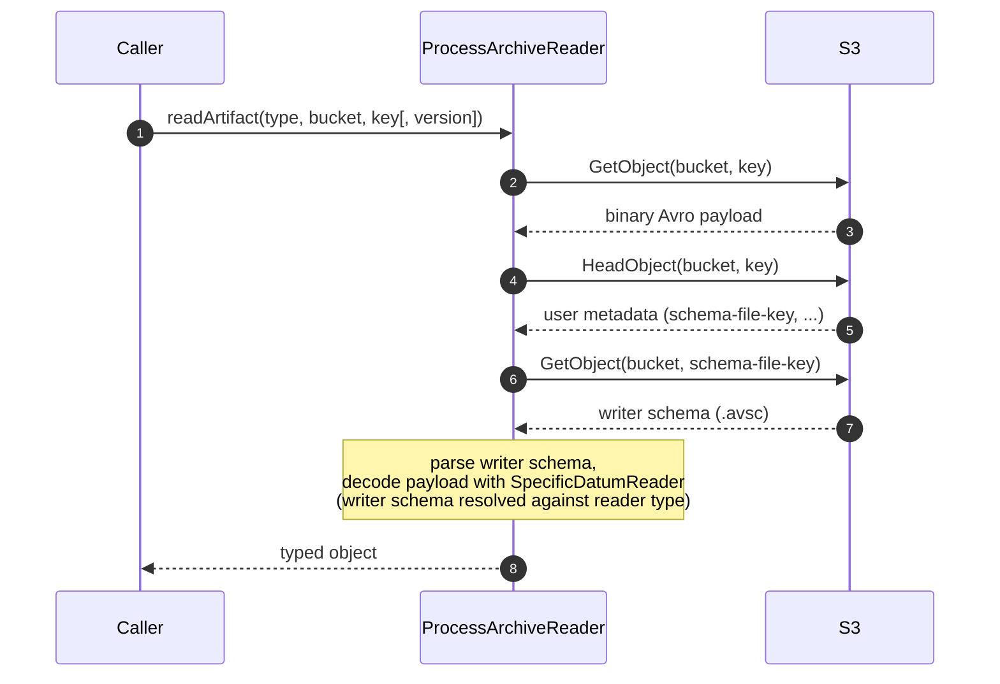

# How it works

`ProcessArchiveReader` turns a bucket and key into a typed object by combining an Avro *schema-on-read*
strategy with S3 object metadata that the producer side (the jEAP Process Archive Service) writes when an
artifact is archived.

## The read flow

1. The object is fetched from S3 together with its user metadata (`GetObject` for the bytes, `HeadObject`
   for the metadata). When a `version` is supplied, the S3 `versionId` is used for both calls.
2. The writer schema is located via the object's `schema-file-key` metadata entry, fetched as a separate
   S3 object and parsed with the Avro `Schema.Parser`.
3. A `SpecificDatumReader` decodes the binary payload, resolving the writer schema against the reader
   schema embedded in the requested Avro-generated class. Avro schema resolution makes compatible
   evolution (added fields with defaults, etc.) transparent.

## S3 object layout

Each archived artifact relies on two S3 objects and on object metadata:

| Element                    | Source                   | Meaning                                                            |
|----------------------------|--------------------------|--------------------------------------------------------------------|
| Object payload             | bucket + key             | The binary Avro-encoded artifact                                   |
| `schema-file-key` metadata | object user metadata     | Key of the S3 object that holds the writer schema (`.avsc`)        |
| Writer schema object       | bucket + schema-file-key | The Avro schema the payload was written with                       |
| `is_encrypted` metadata    | object user metadata     | `true` when the payload is encrypted (see encrypted artifacts doc) |

## Versions

`readArtifact(type, bucket, key)` reads the current version of the object. The overload
`readArtifact(type, bucket, key, version)` passes the value through to S3 as the object `versionId`, so it
returns a specific historical version from a version-enabled bucket.

## Error handling

All failures surface as an unchecked `ProcessArchiveReaderException`. Its static factory methods map the
distinct failure modes:

| Factory method                     | Cause                                                        |
|------------------------------------|--------------------------------------------------------------|
| `readException`                    | Avro `AvroTypeException` — writer/reader schema incompatible |
| `ioException`                      | `IOException` while decoding the payload                     |
| `writerSchemaNotReadableException` | S3 error while fetching the writer schema object             |
| `writerSchemaParseException`       | The writer schema could not be parsed                        |

## Related

- [Getting started](getting-started.md)
- [Reading encrypted artifacts](reading-encrypted-artifacts.md)
- [Configuration reference](configuration.md)
- [jeap-process-archive-reader](../README.md)
